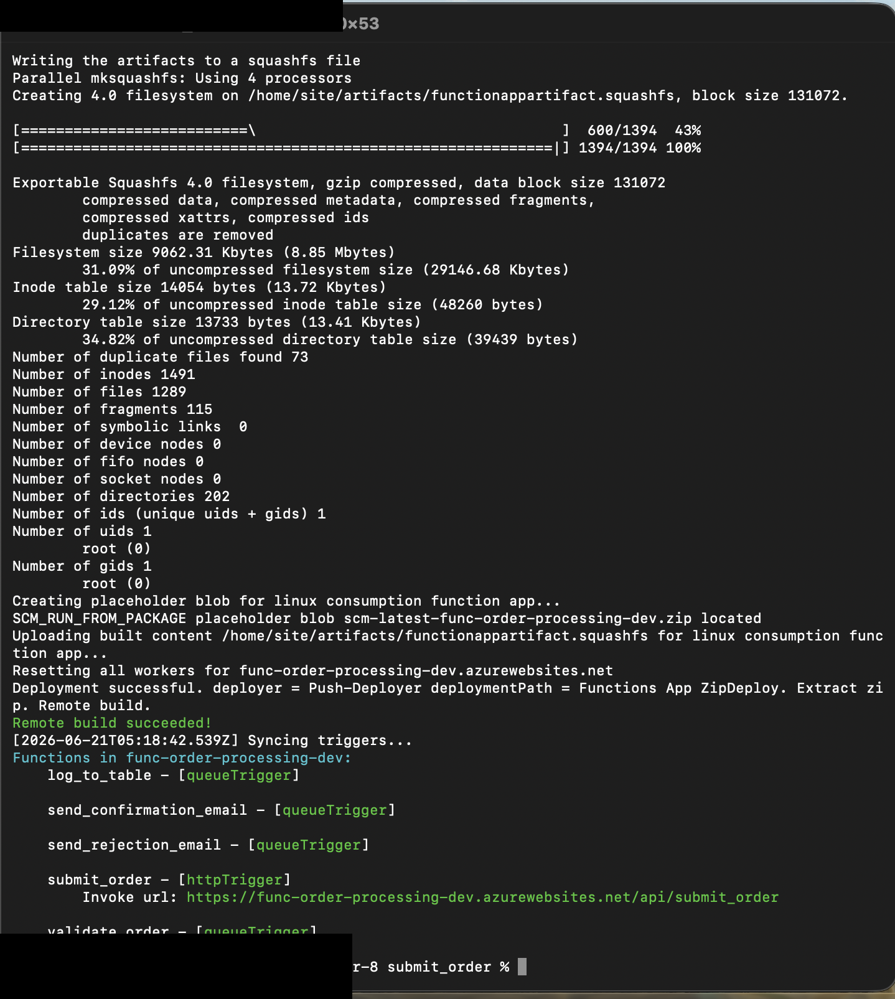
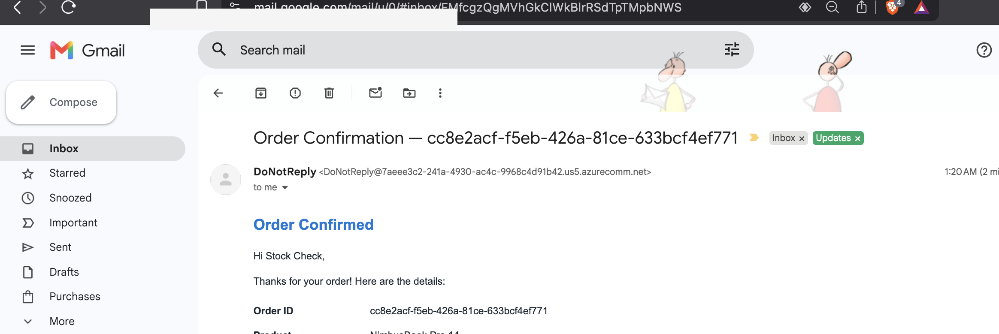
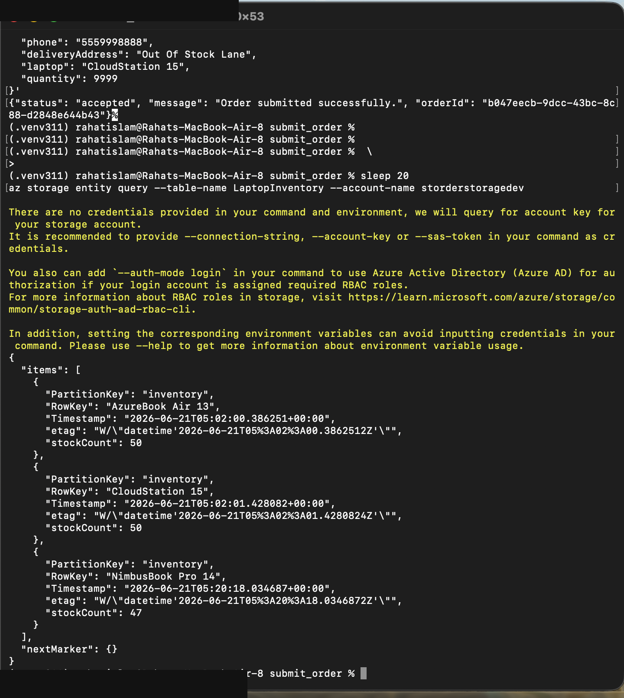
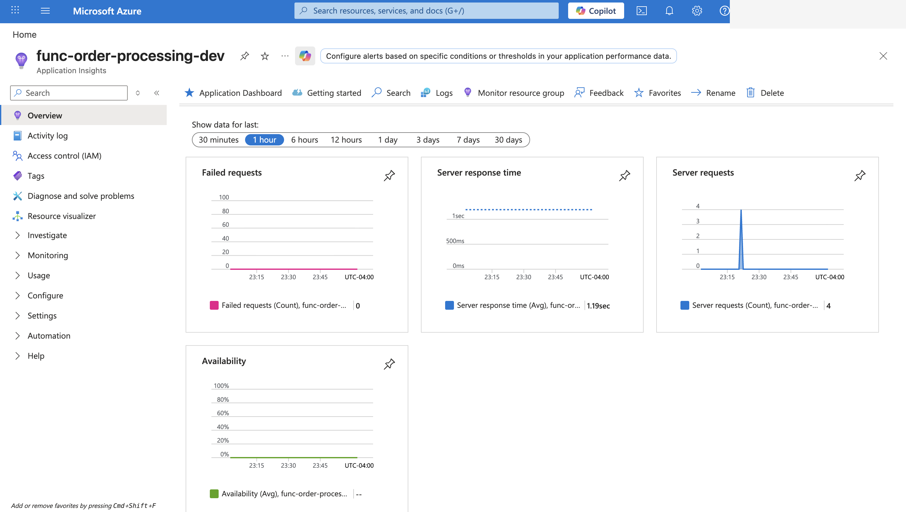

# Azure Event-Driven Serverless Order Processing System

**Production-deployed on Azure** · Python 3.11 (Azure Functions v2) · Storage Queues · Table Storage · Communication Services · Application Insights

An event-driven order-processing pipeline built on Azure Functions. Orders are accepted over HTTP, validated asynchronously through a queue, checked against live inventory, and fanned out to independent queues for email notification, logging, and rejection handling — with transactional email via Azure Communication Services and end-to-end telemetry in Application Insights.

Designed, built, tested, and deployed solo by **Md Rahat Islam Anik**.

[**Live storefront**](https://rahatislamanik-spec.github.io/Azure-Event-Driven-Serverless-Order-Processing-System/) · [Architecture](#architecture) · [Run locally](#running-locally) · [Environments](#environments--promotion-path) · [Evidence](#evidence)

---

## Where the engineering is

The system runs on **Python 3.11 using the Azure Functions v2 programming model**. Five triggers are registered in a single `function_app.py` — the idiomatic v2 layout — covering HTTP intake, queue-triggered validation, inventory checks, fan-out routing, table logging, and transactional email.

GitHub may report this repository as majority-HTML: the storefront and evidence pages are static HTML, flagged as documentation via `.gitattributes`. That's presentation, not application code. **The runtime is Python** — see [`functions/`](./functions).

---

## Overview

A customer order is accepted by an HTTP-triggered function, placed on a queue, and validated asynchronously against live inventory. Valid orders fan out to separate queues for confirmation email, table logging, and (on failure) rejection email. Every stage emits telemetry to Application Insights, and all secrets are resolved at runtime from Key Vault via Managed Identity.

The architecture, all five functions, security hardening, monitoring, and the full test matrix are my own work. The project originated as a group assignment in George Brown College's Cloud Computing capstone (T465); requirements and logical architecture were planned collaboratively, but the entire implementation and deployment documented here was designed and delivered individually.

---

## Architecture

\`\`\`
Customer
   |
   v
Storefront (static frontend)
   |  HTTP POST /api/submit_order
   v
submit_order  --->  orders-incoming  (queue)
                        |
                        v
                   validate_order  --->  LaptopInventory (Table Storage)
                        |                 stock check + decrement
                        |
          +-------------+--------------+
          v             v              v
   orders-to-email  orders-to-log  orders-invalid
          |             |              |
          v             v              v
   send_confirmation  log_to_table  send_rejection
   (ACS email)        (Table)       (ACS email)

  All stages ---> Application Insights (traces, metrics, alerts)
\`\`\`

### Azure services

| Service | Role |
|---|---|
| **Azure Functions** (Python 3.11, v2) | Serverless compute — all five pipeline stages |
| **Azure Storage Queues** | Asynchronous, decoupled message passing between stages |
| **Azure Table Storage** | Order persistence and \`LaptopInventory\` stock tracking |
| **Azure Communication Services** | Transactional confirmation and rejection email |
| **Azure Key Vault** | Secret storage, resolved at runtime — no secrets in source |
| **Managed Identity** | Passwordless auth from Functions to Key Vault and Storage |
| **Application Insights / Azure Monitor** | Distributed tracing, metrics, and alerting |
| **GitHub Pages** | Frontend hosting (documented substitute for Static Web Apps) |

> **Hosting note:** Azure Static Web Apps was unavailable in all supported regions under the Azure for Students subscription, so the static frontend is served from GitHub Pages. The serverless backend runs entirely on Azure.

---

## Functions

All five functions are implemented in a single [\`functions/submit_order/function_app.py\`](./functions/submit_order/function_app.py), registered as separate triggers under the Azure Functions Python v2 programming model (multiple triggers, one function app):

| Function | Trigger | Responsibility |
|---|---|---|
| \`submit_order\` | HTTP | Accept and enqueue the order |
| \`validate_order\` | Queue (\`orders-incoming\`) | Validate fields, check + decrement inventory, fan out |
| \`send_confirmation_email\` | Queue (\`orders-to-email\`) | Send confirmation via ACS |
| \`send_rejection_email\` | Queue (\`orders-invalid\`) | Send rejection via ACS |
| \`log_to_table\` | Queue (\`orders-to-log\`) | Persist the order record |

> The \`validate_order/\`, \`send_confirmation_email/\`, and \`log_to_table/\` folders
> contain per-function README notes; the runnable code for all five triggers lives
> in \`submit_order/function_app.py\`, per the v2 single-app model.

---

## Running locally

### Prerequisites
- Python 3.11
- Azure Functions Core Tools v4
- Azurite (local storage emulator)
- An Azure Communication Services connection string for email

### Setup
\`\`\`bash
git clone git@github.com:rahatislamanik-spec/Azure-Event-Driven-Serverless-Order-Processing-System.git
cd Azure-Event-Driven-Serverless-Order-Processing-System/functions/submit_order

python -m venv .venv
source .venv/bin/activate          # Windows: .venv\Scripts\activate
pip install -r requirements.txt

cp local.settings.example.json local.settings.json
# Fill in AzureWebJobsStorage and the ACS connection string
\`\`\`

### Run
\`\`\`bash
azurite            # terminal 1 — local storage emulator
func start         # terminal 2 — Functions host
\`\`\`
The intake endpoint is available at \`http://localhost:7071/api/submit_order\`.

### Test the pipeline
\`\`\`bash
curl -X POST http://localhost:7071/api/submit_order \
  -H "Content-Type: application/json" \
  -d '{"customer_email":"test@example.com","laptop_model":"CoreTech Pro","quantity":1}'
\`\`\`

---

## Environments & promotion path

Code is validated locally, deployed to a non-production Azure environment for end-to-end testing against live services, then promoted to production.

| Stage | Environment | Purpose |
|---|---|---|
| **Local** | Azurite + \`func start\` | Develop and test against emulated storage — zero cloud cost |
| **Validation** | Azure (non-prod resource group) | Run the full test matrix against live Azure services before promoting |
| **Production** | Azure (prod resource group) | Live deployment — Key Vault-backed config, Managed Identity, Application Insights alerting |

Secrets never live in source: production resolves them from Key Vault via Managed Identity; local development uses an untracked \`local.settings.json\`.

---

## Testing

End-to-end test matrix run against live Azure services in the validation environment before production promotion:

| Scenario | Expected result |
|---|---|
| Valid order, in stock | Confirmation email, inventory decremented, order logged |
| Missing required fields | Rejected, rejection email |
| Invalid email format | Rejected, rejection email |
| Quantity of zero | Rejected |
| Insufficient stock | Rejected, rejection email |
| Unknown laptop model | Rejected, rejection email |

---

## Evidence

Selected proof the deployed system works end to end. Full curated evidence set in [\`evidence/\`](./evidence).

**All five functions deployed and running in Azure**

**Valid order -> confirmation email received**

**Inventory tracked in Table Storage**

**Live telemetry in Application Insights**

---

## Tech stack

**Language:** Python 3.11
**Compute:** Azure Functions (v2 programming model)
**Messaging:** Azure Storage Queues
**Storage:** Azure Table Storage
**Email:** Azure Communication Services
**Security:** Azure Key Vault, Managed Identity
**Observability:** Application Insights, Azure Monitor
**CI/CD & hosting:** GitHub Actions, GitHub Pages

---

## Acknowledgements

Originated as a team assignment for the T465 Work-Integrated Learning capstone at George Brown College, under Program Director Ali Ziyaei. Early planning (requirements and logical architecture) was collaborative; the implementation, deployment, testing, and documentation in this repository are solo work.

## License

[MIT](./LICENSE)
